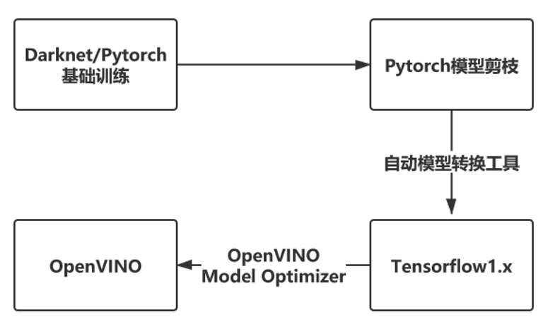

# Pruned-OpenVINO-YOLO

## 简介

在OpenVINO 上部署YOLO目标检测算法时，完整版的模型帧率低，而tiny模型精度低，稳定性差。完整版的模型结构往往是为了能够在较复杂的场景检测80个甚至更多类别而设计，而在我们实际使用中，往往只有几个类别且场景没那么复杂。本教程将分享如何对YOLOv3/v4模型进行剪枝优化，再于OpenVINO部署，在很少损失精度的情况下在intel推理设备上获得数倍的帧率提升。

大致流程如下：




下面以YOLOv3-SPP与YOLOv4模型为例，介绍基础训练，模型剪枝与在OpenVINO部署的细节

注：我使用的数据集为COCO2014 提取的人+车两类与自己挑选并标注的UA-DETRAC数据集，其中有54647张训练集，22998张测试集


## 基础训练

基础训练也就是正常地用自己的数据集训练，将模型训练到合适的精度。

推荐使用：

- https://github.com/ultralytics/yolov3 
- 下面使用的剪枝代码同样支持基础训练 

由于上述项目对YOLOv4的支持不是很完备,可能会导致YOLOv4的训练效果稍差一些。

​                                                  **YOLOv3-SPP  基础训练（baseline）结果**

| P     | R     | mAP@0.5 | Params | Size of   .weights | Inference_time  (Tesla  P100) | BFLOPS |
| ----- | ----- | ------- | ------ | ------------------ | ----------------------------- | ------ |
| 0.554 | 0.709 | 0.667   | 62.5M  | 238M               | 17.4ms                        | 65.69  |

​                                              **YOLOv4模型基础训练（baseline）结果**

| P     | R     | mAP@0.5 | Params | Size of   .weights | Inference_time  (Tesla T4s) | BFLOPS |
| ----- | ----- | ------- | ------ | ------------------ | --------------------------- | ------ |
| 0.587 | 0.699 | 0.669   | 62.5M  | 244M               | 28.3ms                      | 59.57  |

 

## 模型剪枝

采用[tanluren](https://github.com/tanluren)与[zbyuan](https://github.com/zbyuan)大佬的项目[yolov3-channel-and-layer-pruning](https://github.com/tanluren/yolov3-channel-and-layer-pruning)

此剪枝项目以[ultralytics/yolov3](https://github.com/ultralytics/yolov3)为基础实现，Pruneyolov3v4文件夹 是我使用的剪枝代码版本，此版本基于2020年6月的ultralytics/yolov3实现，仅供参考，使用方法与[yolov3-channel-and-layer-pruning](https://github.com/tanluren/yolov3-channel-and-layer-pruning)相同，由于训练过程加入了更多的tricks，训练的mAP@0.5指标会稍高一些，P与R 也不太会出现相差过于悬殊的情况。 

模型剪枝部分如果有问题也可以在[yolov3-channel-and-layer-pruning](https://github.com/tanluren/yolov3-channel-and-layer-pruning)提问，[tanluren](https://github.com/tanluren)与[zbyuan](https://github.com/zbyuan)大佬更加专业。 我也只使用了部分剪枝策略并将剪枝结果在此分享。

### 稀疏训练

基础训练保存的pt权重包含epoch信息，可通过`python -c "from models import *; convert('cfg/yolov3.cfg', 'weights/last.pt')"`转换为darknet weights去除掉epoch信息，使用darknet weights从epoch 0开始稀疏训练。

```
python train.py --cfg cfg/my_cfg.cfg --data data/my_data.data --weights weights/last.weights --epochs 300 --batch-size 32 -sr --s 0.001 --prune 1
```

注意事项：

- 训练过程中尽量不要中断，一次性训练完。  [ultralytics/yolov3](https://github.com/ultralytics/yolov3)存在中断训练各项指标不连续，大幅下滑的问题。

- 稀疏训练过程中，mAP@0.5会先逐渐降低，在训练后期学习率降低后会慢慢升回来。可以先将s设置为0.001，如果前几个epoch mAP@0.5大幅下滑，P ，R，mAP@0.5 三个指标中甚至会出现降到了0的情况，那就调小s的值，如0.0001，但这也意味着可能需要更多的epoch才能充分稀疏化

  下图是我对YOLOv4模型稀疏训练的tensorboard图

  

​       稀疏训练前期虽然mAP有下滑，但最低也保持在了0.4以上，说明选择的s值是比较合适的，但在230个epoch时训练出现了异常，P陡增，R陡降（一度趋近于0），mAP@0.5也大幅度下滑。这样的情况在训练中后期正常情况下不会出现，即使遇到了我这样的情况也不用慌，如果各项指标有恢复正常趋势就没有影响。如果迟迟恢复不了那可能需要重新训练了。

- 参数 epochs我一般都设置300以保证充分稀疏化，可以根据自己数据集的情况进行调整，稀疏化不充分将极大地影响后续剪枝效果。 

- 可以通过观察tensorboard中HISTOGRAMS下的bn_weights/hist 图观察训练过程中是否成功进行了稀疏化。

  可以看到在稀疏过程Gmma大部分逐渐被压到接近0。


- 通过tensorboard中HISTOGRAMS下的稀疏训练后的各个BN层的Gmma权重分布图（在最后一个epoch完成后才会生成）来判断是否充分稀疏化。

下图是YOLOv4进行300个epoch的稀疏训练后的结果，可以看到绝大部分的Gmma权重都趋于0，越趋近于0稀疏化越充分。下图已经可以认为是能够接受的稀疏化结果，仅供参考。


tensorboard也提供了稀疏训练前的BN层的Gmma权重分布图，可以作为对比：


在稀疏训练后，YOLOv3-SPP 的mAP@0.5下降了4个点，YOLOv4下降了7个点。

​                                      **YOLOv3-SPP稀疏训练（Sparsity training）模型参数**

| Model              | P     | R    | mAP@0.5 |
| ------------------ | ----- | ---- | ------- |
| Sparsity  training | 0.525 | 0.67 | 0.624   |

​                                      **YOLOv4稀疏训练（sparsity training）模型参数**

| Model              | P     | R     | mAP@0.5 |
| ------------------ | ----- | ----- | ------- |
| Sparsity  training | 0.665 | 0.570 | 0.595   |

 


### 剪枝

充分稀疏化后就可以开始剪枝，剪枝可以分为通道剪枝和层剪枝，均是基于BN层Gmma权重评价，所以稀疏训练是否充分将直接影响剪枝的效果。通道剪枝大幅减少了模型参数数量，权重文件大小，在桌面GPU设备上提速效果可能不如在嵌入式设备上明显。层剪枝有更加普适的加速效果。剪枝完成后进行模型微调来恢复精度。

下面以YOLOv3-SPP与YOLOv4为例介绍如何寻找合适的剪枝点（即在尽可能大的剪枝力度下也保持较高的mAP@0.5），姑且称其为“最佳剪枝点”：

**通道剪枝**：

```
python slim_prune.py --cfg cfg/my_cfg.cfg --data data/my_data.data --weights weights/last.pt --global_percent 0.8 --layer_keep 0.01
```

在设置全局通道剪枝比例（Global percent）时候，可以选取先大间隔再逐渐细分逼近“最佳剪枝点”的策略，如Global percent先取0.7，0.8，0.9。发现取0.7与0.8时候，模型获得了压缩效果的同时精度并没有严重下滑，甚至还会稍稍超过稀疏后的模型，但取0.9时P大幅上升，R和mAP@0.5大幅下滑，可以推测Global percent取0.9时，刚刚超过“最佳剪枝点”，所以逐渐细分取Global percent为0.88，0.89，发现保留三位小数，Global percent取0.88与0.89时的参数相同，模型精度与稀疏后的模型相比几乎没有下滑，但取0.89时会有更佳的压缩效果。若取Global percent为0.91，0.92，0.93，可以发现，取0.9时，P已经上升至极限1，R与mAP@0.5逼近0，在超越这个极限（即Global percent大于0.91）后，P,R，mAP@0.5均无限逼近0。这也意味着已经把起关键作用通道剪掉了。所以可以确定当Global percent取0.89时为“最佳剪枝点”

​                                       **YOLOv3-SPP稀疏后模型在不同全局通道剪枝比例下模型参数**

| Global  percent | P     | R       | mAP@0.5 | Params | Size of   .weights | Inference_time  (Tesla  P100) | BFLOPS |
| --------------- | ----- | ------- | ------- | ------ | ------------------ | ----------------------------- | ------ |
| 0.7             | 0.572 | 0.659   | 0.627   | 15.7M  | 59.8M              | 16.7ms                        | 25.13  |
| 0.8             | 0.575 | 0.656   | 0.626   | 7.8M   | 30M                | 16.7ms                        | 18.07  |
| 0.88            | 0.574 | 0.652   | 0.621   | 2.7M   | 10.2M              | 16.6ms                        | 13.27  |
| 0.89            | 0.574 | 0.652   | 0.621   | 2.6M   | 10.1M              | 16.5ms                        | 13.23  |
| 0.9             | 0.859 | 0.259   | 0.484   | 2.5M   | 9.41M              | 16.3ms                        | 12.71  |
| 0.91            | 1     | 0.00068 | 0.14    | 2.1M   | 9.02M              | 16.4ms                        | 11.69  |
| 0.92            | 0     | 0       | 0.00118 | 1.9M   | 7.15M              | 16.1ms                        | 10.99  |
| 0.93            | 0     | 0       | 0       | 1.7M   | 6.34M              | 16.5ms                        | 10.37  |

 

​                                            **YOLOv4稀疏后模型在不同全局通道剪枝比例下模型参数**

| Global  percent | P     | R       | mAP@0.5 | Params | Size of   .weights | Inference_time  (Tesla T4) | BFLOPS |
| --------------- | ----- | ------- | ------- | ------ | ------------------ | -------------------------- | ------ |
| 0.5             | 0.693 | 0.559   | 0.594   | 19.8M  | 75.8M              | 18.0ms                     | 26.319 |
| 0.6             | 0.697 | 0.552   | 0.584   | 12.8M  | 49.1M              | 17.7ms                     | 20.585 |
| 0.7             | 0.699 | 0.55    | 0.581   | 7.1M   | 27.0M              | 17.6ms                     | 15.739 |
| 0.8             | 0.696 | 0.544   | 0.578   | 3.0M   | 11.6M              | 16.4ms                     | 11.736 |
| 0.82            | 0.697 | 0.542   | 0.575   | 2.4M   | 9.49M              | 16.5ms                     | 11.033 |
| 0.84            | 0.698 | 0.54    | 0.574   | 2.0M   | 7.84M              | 16.5ms                     | 10.496 |
| 0.86            | 0.698 | 0.54    | 0.571   | 1.7M   | 6.58M              | 16.4ms                     | 9.701  |
| 0.88            | 0.706 | 0.536   | 0.57    | 1.5M   | 6.09M              | 16.4ms                     | 8.692  |
| 0.89            | 0.787 | 0.0634  | 0.204   | 1.3M   | 5.36M              | 16.5ms                     | 8.306  |
| 0.9             | 0.851 | 0.00079 | 0.0329  | 1.2M   | 4.79M              | 16.5ms                     | 7.927  |

同理，可以判断Global percent取0.88时为通道剪枝的“最佳剪枝点”。


在通道剪枝的基础下，可以进行层剪枝。


**层剪枝**：

```
python layer_prune.py --cfg cfg/my_cfg.cfg --data data/my_data.data --weights weights/last.pt --shortcuts 12
```

 

参数shortcuts 就是剪掉的Resunit数量，即下表中的Cut Resunit参数。

​                                **YOLOv3-SPP-Global-Percent0.89在不同层剪枝力度下的模型参数**    

| Cut  Resunit | P     | R      | mAP@0.5 | Params | Size of   .weights | Inference_time  (Tesla  P100) | BFLOPS |
| ------------ | ----- | ------ | ------- | ------ | ------------------ | ----------------------------- | ------ |
| 16           | 0.492 | 0.421  | 0.397   | 2.3M   | 8.97M              | 10.4ms                        | 12.39  |
| 17           | 0.48  | 0.365  | 0.342   | 2.2M   | 8.55M              | 9.7ms                         | 11.79  |
| 18           | 0.547 | 0.166  | 0.205   | 2.1M   | 7.99M              | 9.1ms                         | 11.02  |
| 19           | 0.561 | 0.0582 | 0.108   | 2.0M   | 7.82M              | 8.9ms                         | 10.06  |
| 20           | 0.631 | 0.0349 | 0.0964  | 1.9M   | 7.43M              | 8.2ms                         | 9.93   |

分析上表可以发现，每多剪一个Res unit，P都会增加，R和mAP@0.5都会下滑，这也符合通道剪枝时所介绍的理论预期。一般来说，一个好的模型P与R应该都在一个较高水平且较为接近。当剪掉18个Res unit时候，R与mAP@0.5都出现了大幅度的下滑，且此时R与P已经有较大的差距，所以此时已经超过了最佳剪枝点，如果再进一步加大剪枝掉的Res unit数量，R与mAP@0.5已经开始向0逼近。为了最大化加速效果，应该剪掉尽可能多的Res unit，而剪掉17个Res unit（共51个层）显然是尽可能保持模型精度的最佳选择即“最佳剪枝点”。

同时Inference_time与baseline模型相比也体现了层剪枝非常明显的加速效果。

​                                    **YOLOv4-Global Percent0.88在不同层剪枝力度下的模型参数**    

| Cut  Resunit | P     | R      | mAP@0.5 | Params | Size of   .weights | Inference_time  (Tesla T4) | BFLOPS |
| ------------ | ----- | ------ | ------- | ------ | ------------------ | -------------------------- | ------ |
| 14           | 0.686 | 0.473  | 0.507   | 1.5M   | 5.78M              | 12.1ms                     | 8.467  |
| 17           | 0.704 | 0.344  | 0.419   | 1.4M   | 5.39M              | 11.0ms                     | 7.834  |
| 18           | 0.678 | 0.31   | 0.377   | 1.3M   | 5.33M              | 10.9ms                     | 7.815  |
| 19           | 0.781 | 0.0426 | 0.121   | 1.3M   | 5.22M              | 10.5ms                     | 7.219  |
| 20           | 0.765 | 0.0113 | 0.055   | 1.2    | 4.94M              | 10.4ms                     | 6.817  |

同理可以判断，全局通道剪枝比例0.88，剪掉18个Res unit（即剪掉54个层）为该YOLOv4的“最佳剪枝点”。


### 模型微调

```
python train.py --cfg cfg/prune_0.85_my_cfg.cfg --data data/my_data.data --weights weights/prune_0.85_last.weights --epochs 100 --batch-size 32
```

在模型的前几个epoch设置了warmup，这有助于剪枝后模型的精度恢复，默认为6个，如果觉得偏多可以自行修改train.py代码。

我使用默认的6个epoch 的warmup，微调的结果如下：

​                                          **YOLOv3-SPP baseline模型与剪枝微调后模型参数对比**

| Model           | P     | R     | mAP@0.5 | Params | Size of   .weights | Inference_time  (Tesla  P100) | BFLOPS |
| --------------- | ----- | ----- | ------- | ------ | ------------------ | ----------------------------- | ------ |
| baseline        | 0.554 | 0.709 | 0.667   | 62.5M  | 238M               | 17.4ms                        | 65.69  |
| After  finetune | 0.556 | 0.663 | 0.631   | 2.2M   | 8.55M              | 9.7ms                         | 11.79  |


​      **YOLOv3-SPP剪枝后模型BN层权重绝对值分布图（左）微调后模型BN层权重绝对值分布图（右）**


至此完成了YOLOv3-SPP的模型剪枝全过程。经过模型剪枝，模型精度损失3个点，而模型参数总量与权重文件大小减少**96.4%**，模型BFLOPS减少**82%**,在Tesla P100 GPU上推理速度提升**44%**。


​                                                  **YOLOv4 baseline模型与剪枝微调后模型参数对比**

| Model           | P     | R     | mAP@0.5 | Params | Size of   .weights | Inference_time  (Tesla T4) | BFLOPS |
| --------------- | ----- | ----- | ------- | ------ | ------------------ | -------------------------- | ------ |
| baseline        | 0.587 | 0.699 | 0.669   | 62.5M  | 244M               | 28.3ms                     | 59.57  |
| After  finetune | 0.565 | 0.626 | 0.601   | 1.3M   | 5.33M              | 10.9ms                     | 7.815  |

 

​           **YOLOv4剪枝后模型BN层权重绝对值分布图（左）微调后模型BN层权重绝对值分布图（右）**

至此完成了YOLOv4的模型剪枝工作，模型精度损失7个点，模型参数量与模型权重文件大小减少**98%**，BFLOPS减少**87%**，在Tesla T4 GPU上推理速度提升**61%**。


 ### 剪枝后模型在OpenVINO的部署 

对于YOLO模型的优化算法有很多，但由于将模型转换到OpenVINO的IR模型时，使用到了基于静态图设计的tensorflow1.x，这使得只要对模型结构进行了更改，就要去调整tensorflow代码。为了简化这一过程，我制作了一个解析剪枝后模型的cfg文件，生成tensorflow代码的工具，使用此工具可以迅速将剪枝后的模型在OpenVINO进行部署。 项目地址： https://github.com/TNTWEN/OpenVINO-YOLO-Automatic-Generation

剪枝后的模型在OpenVINO下，使用intel CPU,GPU,HDDL ,NCS2进行推理均可获得2~3倍的帧率提升。实测可以通过视频拼接的方式，四路416×416的视频拼接为832×832，以实现OpenVINO 四路视频同时进行YOLO目标检测，并且保障基本的实时性需求。

并且此工具有兼容其他YOLO优化算法的潜力，只需要提供优化后模型的cfg文件和权重文件就可以完成模型转换。