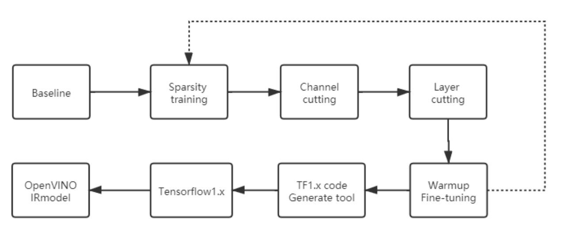

# Pruned-OpenVINO-YOLO
[简体中文](https://github.com/TNTWEN/Pruned-OpenVINO-YOLO/blob/main/README-CHINESE.md)

## Introduction

When deploying YOLOv3/v4 on OpenVINO, the full version of the model has low FPS, while the tiny model has low accuracy and poor stability. The full version of the model structure is often designed to be able to detect 80 or more classes in more complex scenes. In our actual use, there are often only a few classes and the scenes are not that complicated. This tutorial will share how to  prune YOLOv3/v4 model, and then deploy it on OpenVINO. With little loss of accuracy, the frame rate can be increased by several times on the intel inference devices.On the intel GPU device, it can even realize the simultaneous inference of four channels of video and guarantee the basic real-time requirements

The general process is as follows:




The following takes the YOLOv3-SPP and YOLOv4 models as examples to introduce the details of baseline training, model pruning and deployment on OpenVINO

Note: The data set I used is the two classes of people + car extracted by COCO2014 and the UA-DETRAC dataset I picked and labeled. There are 54647 training sets and 22998 test sets.

## development log
<details><summary> <b>Expand</b> </summary>
* `2021-2-25` -  Support yolov4-tiny and yolov4-tiny-3l.Please use https://github.com/tanluren/yolov3-channel-and-layer-pruning to prune yolov4-tiny and yolov4-tiny-3l model and https://github.com/TNTWEN/OpenVINO-YOLO-Automatic-Generation/tree/master/yolov4tiny to convert weights

</details>


## Baseline training

Basic training is to train with your own dataset normally, and train the model to the appropriate accuracy。

Recommended:
- The pruning code used below also supports basic training ★
- https://github.com/ultralytics/yolov3/tree/archive 


Note: As the above-mentioned projects do not support YOLOv4 very well, it may cause the training result of YOLOv4 to be slightly worse.

**YOLOv3-SPP baseline training result**

| P     | R     | mAP@0.5 | Params | Size of   .weights | Inference_time  (Tesla  P100) | BFLOPS |
| ----- | ----- | ------- | ------ | ------------------ | ----------------------------- | ------ |
| 0.554 | 0.709 | 0.667   | 62.5M  | 238M               | 17.4ms                        | 65.69  |

**YOLOv4 baseline training result**

| P     | R     | mAP@0.5 | Params | Size of   .weights | Inference_time  (Tesla T4) | BFLOPS |
| ----- | ----- | ------- | ------ | ------------------ | -------------------------- | ------ |
| 0.587 | 0.699 | 0.669   | 62.5M  | 244M               | 28.3ms                     | 59.57  |

 

## Model pruning

i use this repos [yolov3-channel-and-layer-pruning](https://github.com/tanluren/yolov3-channel-and-layer-pruning)

Thanks [tanluren](https://github.com/tanluren) and[zbyuan](https://github.com/zbyuan) for their great work

This model pruning project is based on [ultralytics/yolov3](https://github.com/ultralytics/yolov3).The folder named after **Pruneyolov3v4** is the version of the pruning code I used.This version is based on the June 2020's ultralytics/yolov3, for reference only.The method of use is the same as [yolov3-channel-and-layer-pruning](https://github.com/tanluren/yolov3-channel-and-layer-pruning). Because more tricks are added to the training process, the training mAP@0.5  will be slightly higher, and P and R will not be too far apart.


If you have any questions about the model pruning part, you can also ask questions here  [yolov3-channel-and-layer-pruning](https://github.com/tanluren/yolov3-channel-and-layer-pruning)
[tanluren](https://github.com/tanluren)and [zbyuan](https://github.com/zbyuan)will be more professional.I only used part of the pruning strategy and share the pruning results here.

### Sparsity training
Note: You could use `python -c "from models import *; convert('cfg/yolov3.cfg', 'weights/last.pt')"` to convert .pt file to .weights file.

.pt file will include epoch information.If you convert it to .weights,you could train model from epoch 0.


```
python train.py --cfg cfg/my_cfg.cfg --data data/my_data.data --weights weights/last.weights --epochs 300 --batch-size 32 -sr --s 0.001 --prune 1
```

**Important note！**：

- Try not to interrupt the training process and finish the training at one time. [ultralytics/yolov3](https://github.com/ultralytics/yolov3) has the problem of discontinuity and sharp decline in various indicators of interrupted training.

- During sparse training, mAP@0.5 will gradually decrease first, and will slowly rise back after the learning rate decreases in the later stage of training. You can first set s to 0.001. If mAP@0.5 drops sharply in the first few epochs, and P, R, and mAP@0.5 may even drop to 0, then adjust the value of s to a smaller value, such as 0.0001, But this also means that more epochs may be needed to fully sparse

 The picture below is my tensorboard diagram of the sparse training of the YOLOv4 model

  

Although mAP declined in the early stage of sparse training, the minimum remained above 0.4, indicating that the selected s value was appropriate. However, training was abnormal at 230 epochs, P increased sharply, and R decreased sharply (at one time it was close to 0 ), mAP@0.5 also fell sharply. This kind of situation will not appear under normal circumstances in the middle and late stages of training. Even if you encounter a situation like mine, don't panic. If the various indicators have a tendency to return to normal, it will have no effect. If it can't recover after a delay, you may need to retrain.

- I generally set the parameter epochs to 300 to ensure sufficient sparseness. You can adjust it according to your own data set. Insufficient sparseness will greatly affect the subsequent pruning effect.

- By observing the bn_weights/hist graph under HISTOGRAMS in tensorboard, you can observe whether the sparsity is successfully performed during training.

   It can be seen that most of the Gmma is gradually pressed to close to 0 during sparsity training .


- The Gmma weight distribution map of each BN layer after the sparse training under HISTOGRAMS in tensorboard (generated after the last epoch is completed) is used to determine whether the sparseness is sufficient.

The figure below is the result of YOLOv4's sparse training for 300 epochs. It can be seen that most of the Gmma weights tend to 0, and the closer to 0 the more sparseness is. The following figure can already be considered an acceptable sparseness result and is for reference only.


tensorboard also provides the Gmma weight distribution map of the BN layer before sparse training, which can be used as a comparison：


After sparsity training, mAP@0.5 of YOLOv3-SPP dropped by 4 points, and YOLOv4 dropped by 7 points.

​ **YOLOv3-SPP after sparsity training**

| Model              | P     | R    | mAP@0.5 |
| ------------------ | ----- | ---- | ------- |
| Sparsity  training | 0.525 | 0.67 | 0.624   |

​  **YOLOv4 after sparsity training**

| Model              | P     | R     | mAP@0.5 |
| ------------------ | ----- | ----- | ------- |
| Sparsity  training | 0.665 | 0.570 | 0.595   |

 


### Model pruning

Pruning can be started after sufficient sparseness. Pruning can be divided into channel pruning and layer pruning, both of which are evaluated based on the Gmma weight of the BN layer, so whether the sparse training is sufficient will directly affect the effect of pruning. Channel pruning greatly reduces the number of model parameters and the size of weight files. The speed-up effect on desktop GPU devices may not be as obvious as on embedded devices. Layer pruning has a more universal acceleration effect. After the pruning is complete, fine-tune the model to restore accuracy.

The following uses YOLOv3-SPP and YOLOv4 as examples to introduce how to find a suitable pruning point (maintain a high mAP@0.5 under the greatest possible pruning force), and i call it the "optimal pruning point":

**channel pruing**：

```
python slim_prune.py --cfg cfg/my_cfg.cfg --data data/my_data.data --weights weights/last.pt --global_percent 0.8 --layer_keep 0.01
```

When setting the global channel pruning ratio (Global percent), you can choose a strategy of large intervals and then gradually subdividing to approach the "optimal pruning point". For example, the Global percent first takes 0.7, 0.8, and 0.9. It is found that when 0.7 and 0.8 are taken, the model obtains the compression effect while the accuracy does not decline seriously, and even slightly exceeds the model after spasity training. However, when taking 0.9, P rises sharply, and R and mAP@0.5 drop sharply. It can be inferred that When Global percent is 0.9, it just exceeds the "optimal pruning point", so the Global percent is gradually subdivided into 0.88 and 0.89.And when the Global percent is 0.88 and 0.89,the parameters are the same with three decimal places retained. And the model accuracy is very close to  model after spasity training,but 0.89 will have a better compression effect. If we take Global percent as 0.91, 0.92, 0.93, we can find that when we take 0.9, P has risen to the limit 1, and R and mAP@0.5 are close to 0. After this limit is exceeded (that means the Global percent is greater than 0.91), P, R, mAP@0.5 is infinitely close to 0. This also means that the key channels have been cut off.

 So it can be determined that when the Global percent is 0.89, it is the "optimal pruning point"

​ **YOLOv3-SPP's parameters of the model after spasity training under different global channel pruning scales**

| Global  percent | P     | R       | mAP@0.5 | Params | Size of   .weights | Inference_time  (Tesla  P100) | BFLOPS |
| --------------- | ----- | ------- | ------- | ------ | ------------------ | ----------------------------- | ------ |
| 0.7             | 0.572 | 0.659   | 0.627   | 15.7M  | 59.8M              | 16.7ms                        | 25.13  |
| 0.8             | 0.575 | 0.656   | 0.626   | 7.8M   | 30M                | 16.7ms                        | 18.07  |
| 0.88            | 0.574 | 0.652   | 0.621   | 2.7M   | 10.2M              | 16.6ms                        | 13.27  |
| 0.89            | 0.574 | 0.652   | 0.621   | 2.6M   | 10.1M              | 16.5ms                        | 13.23  |
| 0.9             | 0.859 | 0.259   | 0.484   | 2.5M   | 9.41M              | 16.3ms                        | 12.71  |
| 0.91            | 1     | 0.00068 | 0.14    | 2.1M   | 9.02M              | 16.4ms                        | 11.69  |
| 0.92            | 0     | 0       | 0.00118 | 1.9M   | 7.15M              | 16.1ms                        | 10.99  |
| 0.93            | 0     | 0       | 0       | 1.7M   | 6.34M              | 16.5ms                        | 10.37  |

 

**YOLOv4's parameters of the model after spasity training under different global channel pruning scales**

| Global  percent | P     | R       | mAP@0.5 | Params | Size of   .weights | Inference_time  (Tesla T4) | BFLOPS |
| --------------- | ----- | ------- | ------- | ------ | ------------------ | -------------------------- | ------ |
| 0.5             | 0.693 | 0.559   | 0.594   | 19.8M  | 75.8M              | 18.0ms                     | 26.319 |
| 0.6             | 0.697 | 0.552   | 0.584   | 12.8M  | 49.1M              | 17.7ms                     | 20.585 |
| 0.7             | 0.699 | 0.55    | 0.581   | 7.1M   | 27.0M              | 17.6ms                     | 15.739 |
| 0.8             | 0.696 | 0.544   | 0.578   | 3.0M   | 11.6M              | 16.4ms                     | 11.736 |
| 0.82            | 0.697 | 0.542   | 0.575   | 2.4M   | 9.49M              | 16.5ms                     | 11.033 |
| 0.84            | 0.698 | 0.54    | 0.574   | 2.0M   | 7.84M              | 16.5ms                     | 10.496 |
| 0.86            | 0.698 | 0.54    | 0.571   | 1.7M   | 6.58M              | 16.4ms                     | 9.701  |
| 0.88            | 0.706 | 0.536   | 0.57    | 1.5M   | 6.09M              | 16.4ms                     | 8.692  |
| 0.89            | 0.787 | 0.0634  | 0.204   | 1.3M   | 5.36M              | 16.5ms                     | 8.306  |
| 0.9             | 0.851 | 0.00079 | 0.0329  | 1.2M   | 4.79M              | 16.5ms                     | 7.927  |

In the same way, it can be judged that when the Global percent is 0.88, it is the "optimal pruning point" for channel pruning.


After channel pruning, we could perform layer pruning.


**layer prunine**：

```
python layer_prune.py --cfg cfg/my_cfg.cfg --data data/my_data.data --weights weights/last.pt --shortcuts 12
```

 

The parameter shortcuts is the number of cut Resunits, which is the **Cut Resunit** parameter in the table below.
​                                **YOLOv3-SPP-Global-Percent0.89's parameters under different layer pruning forces**    

| Cut  Resunit | P     | R      | mAP@0.5 | Params | Size of   .weights | Inference_time  (Tesla  P100) | BFLOPS |
| ------------ | ----- | ------ | ------- | ------ | ------------------ | ----------------------------- | ------ |
| 16           | 0.492 | 0.421  | 0.397   | 2.3M   | 8.97M              | 10.4ms                        | 12.39  |
| 17           | 0.48  | 0.365  | 0.342   | 2.2M   | 8.55M              | 9.7ms                         | 11.79  |
| 18           | 0.547 | 0.166  | 0.205   | 2.1M   | 7.99M              | 9.1ms                         | 11.02  |
| 19           | 0.561 | 0.0582 | 0.108   | 2.0M   | 7.82M              | 8.9ms                         | 10.06  |
| 20           | 0.631 | 0.0349 | 0.0964  | 1.9M   | 7.43M              | 8.2ms                         | 9.93   |

Analyzing the above table, it can be found that for each additional Res unit cut, P will increase, and R and mAP@0.5 will fall. This is also in line with the theoretical expectations introduced during channel pruning. Generally speaking, a good model P and R should be at a higher level and closer. When 18 Resunits are cut off, both R and mAP@0.5 have dropped significantly, and there is already a large gap between R and P at this time, so the optimal pruning point has been exceeded at this time. If you go further Increase the number of Resunits pruned, R and mAP@0.5 have begun to approach 0. In order to maximize the acceleration effect, you should cut off as many Resunits as possible, and cutting off 17 Resunits (51 layers in total) is obviously the best choice to maintain the accuracy of the model as much as possible, that is the "optimal pruning point".


At the same time, Inference_time also reflects the obvious acceleration effect of layer pruning compared with the baseline model.

**YOLOv4-Global Percent0.88's parameters under different layer pruning forces**    

| Cut  Resunit | P     | R      | mAP@0.5 | Params | Size of   .weights | Inference_time  (Tesla T4) | BFLOPS |
| ------------ | ----- | ------ | ------- | ------ | ------------------ | -------------------------- | ------ |
| 14           | 0.686 | 0.473  | 0.507   | 1.5M   | 5.78M              | 12.1ms                     | 8.467  |
| 17           | 0.704 | 0.344  | 0.419   | 1.4M   | 5.39M              | 11.0ms                     | 7.834  |
| 18           | 0.678 | 0.31   | 0.377   | 1.3M   | 5.33M              | 10.9ms                     | 7.815  |
| 19           | 0.781 | 0.0426 | 0.121   | 1.3M   | 5.22M              | 10.5ms                     | 7.219  |
| 20           | 0.765 | 0.0113 | 0.055   | 1.2    | 4.94M              | 10.4ms                     | 6.817  |

In the same way, it can be judged that the global channel pruning ratio is 0.88, and 18 Res units are cut (that is, 54 layers are cut) is the "optimal pruning point" of YOLOv4.


### Model fine-tuning

```
python train.py --cfg cfg/prune_0.85_my_cfg.cfg --data data/my_data.data --weights weights/prune_0.85_last.weights --epochs 100 --batch-size 32
```

Warmup is set in the first few epochs of the model, which helps to restore the accuracy of the model after pruning. The default is 6, if you think it is too much, you can modify the train.py code by yourself.

use the default warmup of 6 epochs, and the results of fine-tuning are as follows:

 **Comparison of YOLOv3-SPP baseline model and the model after pruning and fine-tuning**

| Model           | P     | R     | mAP@0.5 | Params | Size of   .weights | Inference_time  (Tesla  P100) | BFLOPS |
| --------------- | ----- | ----- | ------- | ------ | ------------------ | ----------------------------- | ------ |
| baseline        | 0.554 | 0.709 | 0.667   | 62.5M  | 238M               | 17.4ms                        | 65.69  |
| After  finetune | 0.556 | 0.663 | 0.631   | 2.2M   | 8.55M              | 9.7ms                         | 11.79  |


**Distribution map of the absolute value of the weight of the BN layer of the model after YOLOv3-SPP pruning (left) and after fine-tuning (right)**


So far, the whole process of model pruning of YOLOv3-SPP is completed. After model pruning, the model accuracy loses 3 points, and the total model parameters and weight file size are reduced by **96.4%**. Model BFLOPS is reduced by **82%**, and the inference speed on Tesla P100 GPU is increased by **44%**.


 **Comparison of YOLOv4 baseline model and the model after pruning and fine-tuning**

| Model           | P     | R     | mAP@0.5 | Params | Size of   .weights | Inference_time  (Tesla T4) | BFLOPS |
| --------------- | ----- | ----- | ------- | ------ | ------------------ | -------------------------- | ------ |
| baseline        | 0.587 | 0.699 | 0.669   | 62.5M  | 244M               | 28.3ms                     | 59.57  |
| After  finetune | 0.565 | 0.626 | 0.601   | 1.3M   | 5.33M              | 10.9ms                     | 7.815  |

 

​ **Distribution map of the absolute value of the weight of the BN layer of the model after YOLOv4 pruning (left) and after fine-tuning (right)**


So far, the whole process of model pruning of YOLOv4 is completed. After model pruning, the model accuracy loses 7 points, and the total model parameters and weight file size are reduced by **98%**. Model BFLOPS is reduced by **87%**, and the inference speed on Tesla T4 GPU is increased by **61%**.


 ### Deployment of the model after pruning on OpenVINO

There are many optimization algorithms for the YOLO model, but because the model is converted to the OpenVINO IR model, tensorflow1.x based on the static graph design is used, which makes it necessary to adjust the tensorflow code as long as the model structure is changed. In order to simplify this process, I made a tool to analyze the cfg file of the pruned model and generate tensorflow code. With this tool, the pruned model can be quickly deployed in OpenVINO. 

Repositories: https://github.com/TNTWEN/OpenVINO-YOLO-Automatic-Generation

Under OpenVINO, the pruned model can get a 2~3 times increase in frame rate for inference using intel CPU, GPU, HDDL, and NCS2. We can use video splicing, four channels of 416×416 videos are spliced into 832×832, so that OpenVINO four channels of video can simultaneously perform YOLO and ensure basic real-time requirements.

And this tool has the potential to be compatible with other YOLO optimization algorithms. It only needs to provide the cfg file and weight file of the optimized model to complete the model conversion.


Thank you for your use and hope it will help you!
